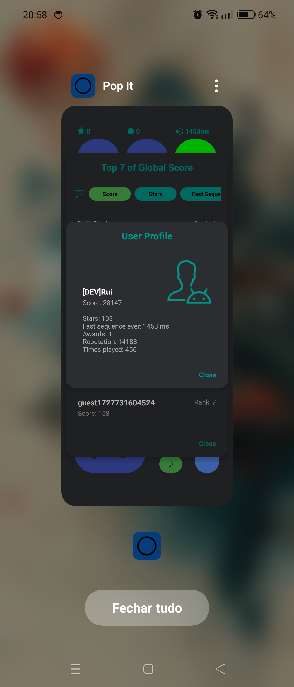

# popit
This game is nothing more than a sketch than I imagined based on physical bubble fidget toys while trying the kotlin language. 
PopIt is a simple anti-stress game with wonderful Lofi beats in the background while you generate sequences of bubbles where you earns points by clicking on them, when you're ready and want more action you have the possibility to compete with other users online due to the existence of a score board.
# popit-releases
This repository hosts the public releases. The releases(apk) are signed that you can deploy to a device.
# popit-features
* Minimalist design: The use of solid colors with little variation of details suggests a clean and direct style.
* Simple geometrical forms: All interactive elements are circles, which contributes to an easy to understand and focused interface on direct interactions.
* Symbol and numbers: Numbers and other icons on the interface, such as music notes, a chronometer, numbers and stars are used to indicate features intuitively.
* Background music: Lofi beats in the background while you generate sequences of bubbles.
* Score board: To compete with other users online.
* User profile: To view more details about the specific user.
* Modern Interface: Interesting for casual users, offering an affordable and friendly interface.
* Awards: Occasionally there will be prizes in the app for you to redeem.
# preview of last release
   
# popit-requirements
Android 10+

