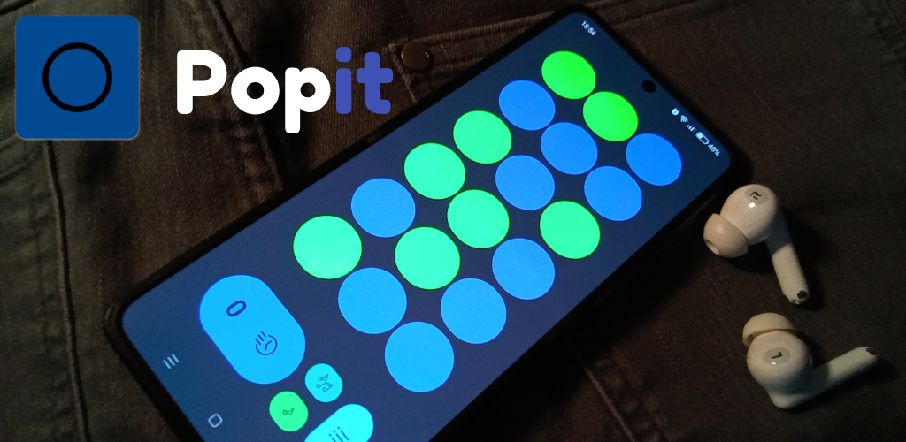

# popit
The PopIt app is based on physical bubble fidget toys. 
PopIt is a simple anti-stress game with wonderful Lofi beats in the background while you generate sequences of bubbles where you earns points by clicking on them, when you're ready and want more action you have the possibility to compete with other users online due to the existence of a score board.
# popit-releases
This repository hosts the public releases. The releases(apk) are signed that you can deploy to a device.

